# 心流广告智链

<p align="center">
  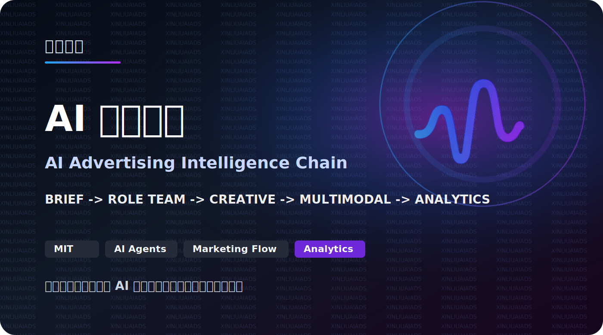
</p>

<p align="center">
  心流造物打造的 AI 广告创意与内容生产平台，集成多角色智能协作、广告策略洞察、创意内容生成、会话管理、数据分析和多媒体生成能力。
</p>

<p align="center">
  <a href="#功能指南">功能截图</a>
  ·
  <a href="#快速开始">快速开始</a>
  ·
  <a href="#english-overview">English</a>
</p>

<p align="center">
  
  
  
  
  
</p>

## Contents

- [平台介绍](#平台介绍)
- [平台价值](#平台价值)
- [核心流程](#核心流程)
- [功能概览](#功能概览)
- [功能指南](#功能指南)
- [适用场景](#适用场景)
- [技术栈](#技术栈)
- [快速开始](#快速开始)
- [环境变量](#环境变量)
- [安全说明](#安全说明)
- [English Overview](#english-overview)

## 平台介绍

**心流广告智链**是一款面向广告营销场景的 AI 创意与内容生产平台。作为心流造物在广告营销领域的 AI 应用产品，平台以“AI 角色团队”为核心，把需求分析、产品定位、用户洞察、传播策略、文案创作、短视频策划、内容优化和数据复盘等工作，拆解为多个专业智能角色，让广告团队可以像组建一支虚拟广告服务团队一样完成创作与协作。

平台不仅提供单角色对话能力，还围绕广告服务流程建设了角色服务、会话历史、文件上传、HTML 页面生成、图像生成、视频生成、Token 用量统计和模块分析等能力。它适合营销团队、品牌方、广告公司、内容团队和创意工作室，用于提升从需求理解到创意交付的效率。

## 平台价值

- **重塑广告服务流程**：通过 AI 角色分工覆盖广告服务链路，让需求拆解、策略判断、创意产出和复盘分析更高效。
- **降低创意生产门槛**：用户可以直接与需求分析专家、产品定位顾问、文案总监、全能创意助手等角色沟通，快速获得专业输出。
- **提升团队交付效率**：通过会话历史、文件上传、角色分类和任务沉淀，减少重复沟通，让创意协作更连续。
- **支持多模态内容生产**：平台对接图像生成、视频生成和 HTML 页面生成能力，覆盖从文字方案到视觉物料的生产需求。
- **让数据驱动运营决策**：通过 Token 用量、角色使用排名、模块使用详情和日期筛选，帮助团队理解平台使用情况和资源消耗。

## 核心流程

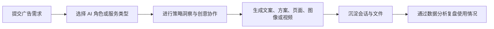

## 功能概览

| 模块 | 说明 |
| --- | --- |
| 用户登录 | 支持手机号验证码登录、密码登录和微信登录。 |
| 单角色服务 | 按策略洞察、创意内容、自由沟通等分类提供专业 AI 角色。 |
| 智能会话 | 支持与指定角色进行连续对话，并保留会话历史。 |
| 文件上传 | 在会话中上传文件，辅助 AI 理解需求和上下文。 |
| 角色服务库 | 包含需求分析专家、产品定位顾问、文案总监、全能创意助手、自由沟通大师等角色。 |
| HTML 生成 | 支持通过工作流生成落地页 HTML，并进行预览和异步任务管理。 |
| 图像生成 | 对接 Midjourney / EQMJ 绘图服务，用于广告视觉与创意图生成。 |
| 视频生成 | 支持文生视频和脚本解析，跟踪视频生成任务状态。 |
| 数据分析 | 提供 Token 用量排名、角色使用统计、模块详情和日期筛选。 |
| 产品展示页 | 提供产品介绍、核心优势、工作流程和价格方案展示。 |

## 功能指南

### 1. 登录入口

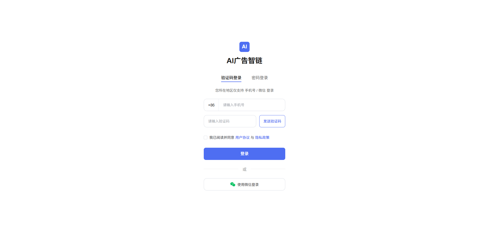

平台提供验证码登录、密码登录和微信登录方式，适合团队成员快速进入广告创作工作台。

### 2. 单角色服务

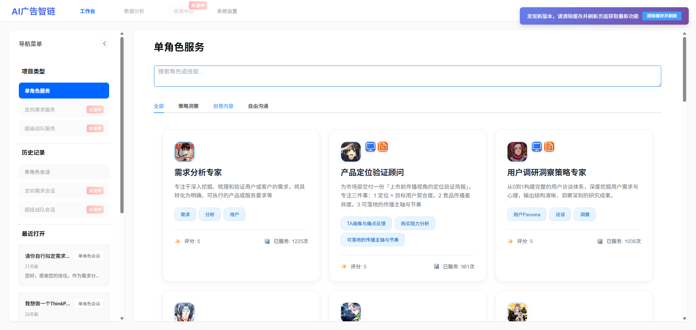

工作台以角色卡片呈现 AI 服务能力，用户可以搜索角色或技能，并按“全部、策略洞察、创意内容、自由沟通”等分类快速定位所需专家。

### 3. 需求分析专家

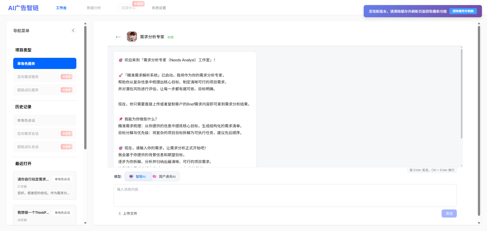

需求分析专家用于帮助用户拆解广告需求，梳理目标、受众、约束条件和执行重点，把模糊需求转化为更清晰的创作方向。

### 4. 产品定位顾问

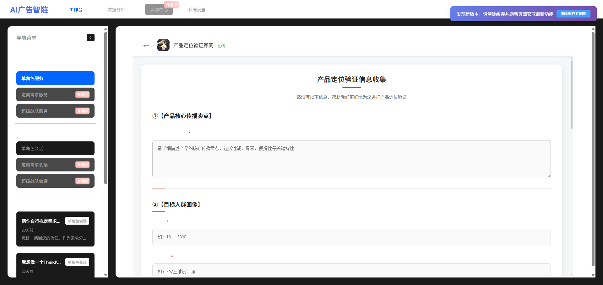

产品定位顾问适合用于市场定位、卖点提炼和传播角度确认，帮助品牌在创意开始前明确产品表达策略。

### 5. 全能创意助手

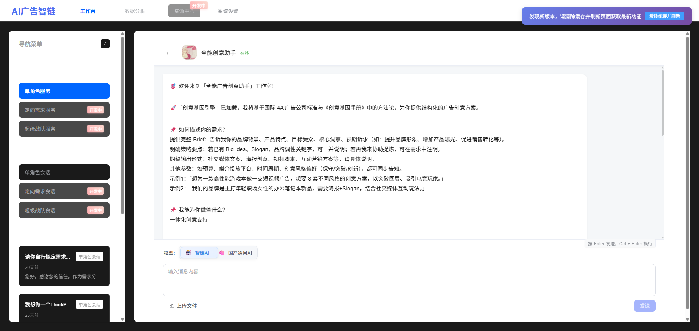

全能创意助手面向综合创意任务，可协助完成广告点子、内容方向、活动创意和多形式传播构思。

### 6. 文案总监

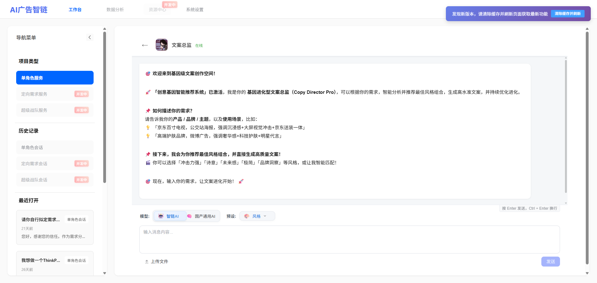

文案总监聚焦广告文案表达，适合生成标题、卖点文案、海报文案、社媒内容和传播话术。

### 7. 自由沟通大师

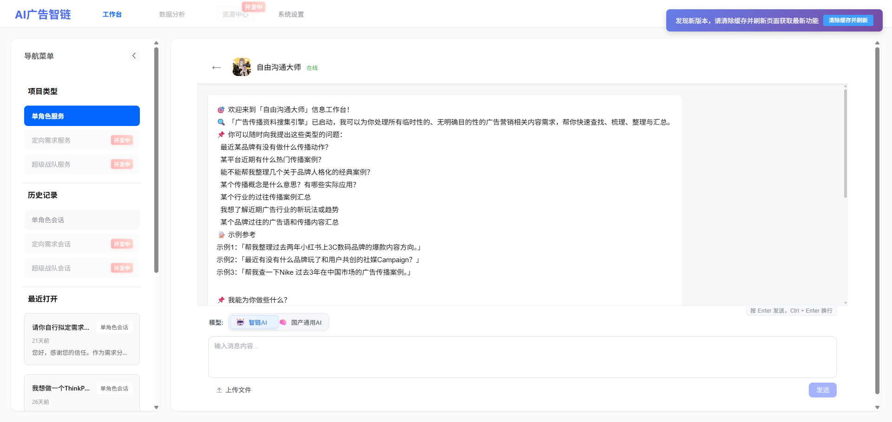

自由沟通大师用于开放式问题讨论，适合创意发散、方案推敲、头脑风暴和临时沟通场景。

### 8. 会话历史

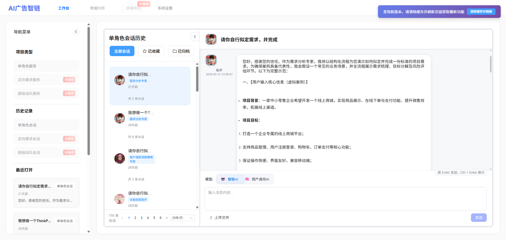

平台会保存单角色会话历史，支持查看历史对话、分页浏览、继续沟通、复制内容和上传文件，让创作过程可追踪、可复用。

### 9. Token 用量排名

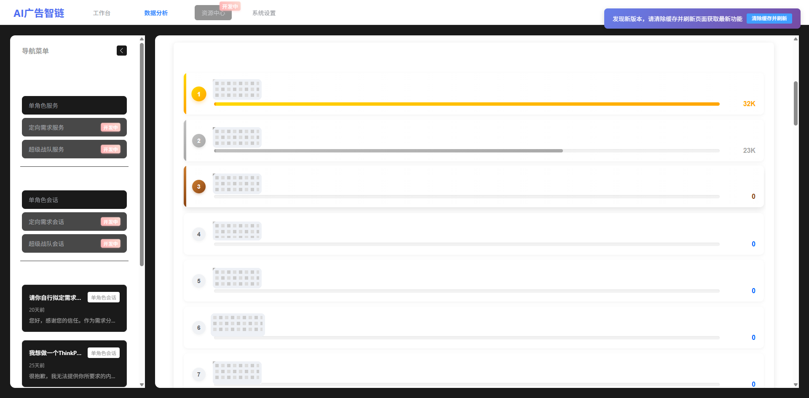

数据分析模块展示用户 Token 用量排名，帮助运营者了解平台资源消耗和高频使用成员。

### 10. 日期时间筛选

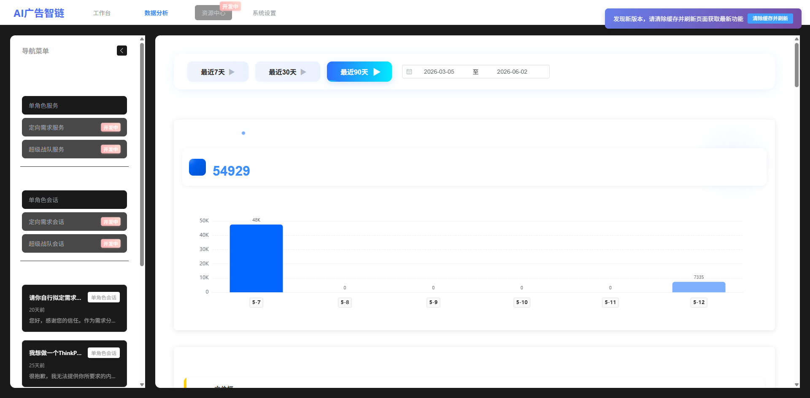

数据分析支持按时间范围筛选，便于查看不同周期内的使用趋势和统计结果。

### 11. 图表分析

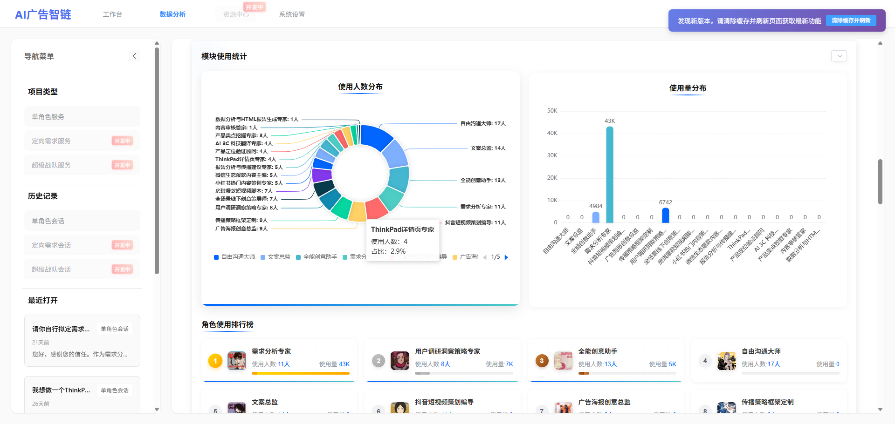

平台以图表方式展示角色使用、模块分布和 Token 使用情况，帮助团队快速识别常用角色和核心场景。

### 12. Token 与模块详情

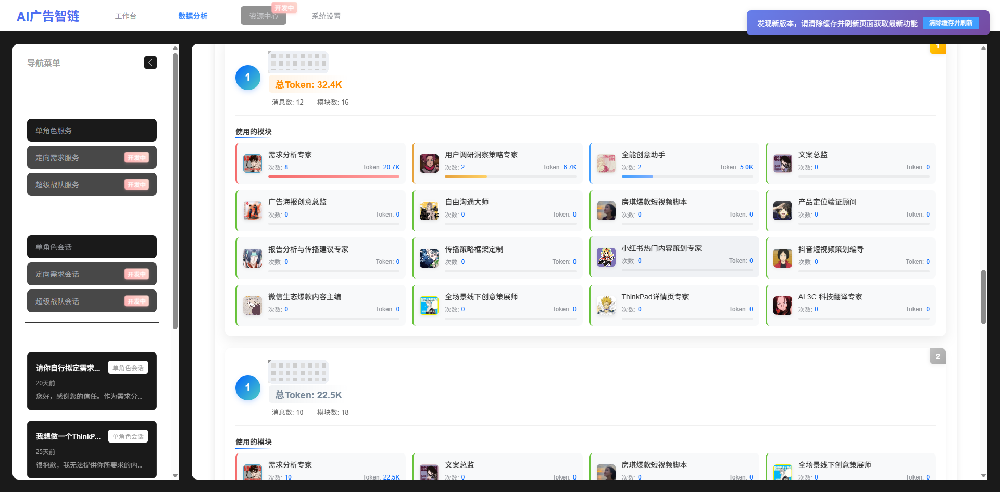

详情页展示用户的总 Token、消息数、使用模块和各角色消耗情况，适合做精细化运营和成本观察。

### 13. 产品介绍页

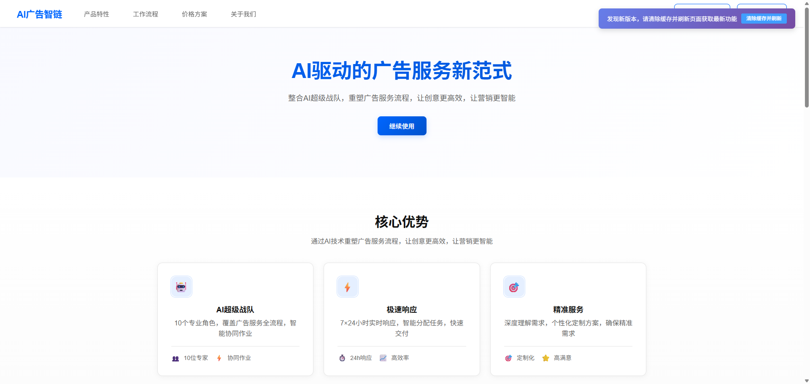

产品介绍页以“AI 驱动的广告服务新范式”为核心表达，强调通过 AI 技术重塑广告服务流程。

### 14. 产品特性

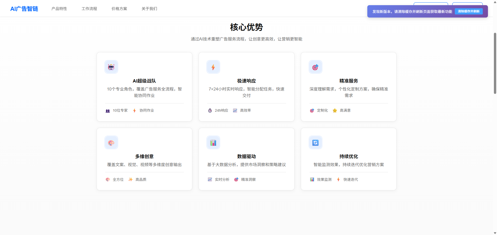

平台突出专业角色、实时响应、精准需求理解、多维度创意输出、数据分析和效果迭代等优势。

### 15. 工作流程

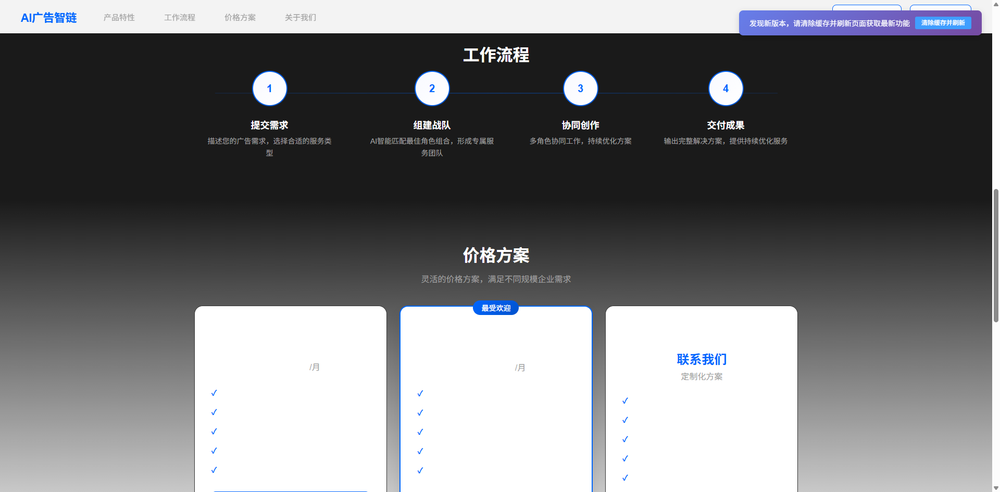

心流广告智链的工作流程包括提交需求、组建战队、协同创作和交付成果，适合对外展示产品服务逻辑。

### 16. 价格方案

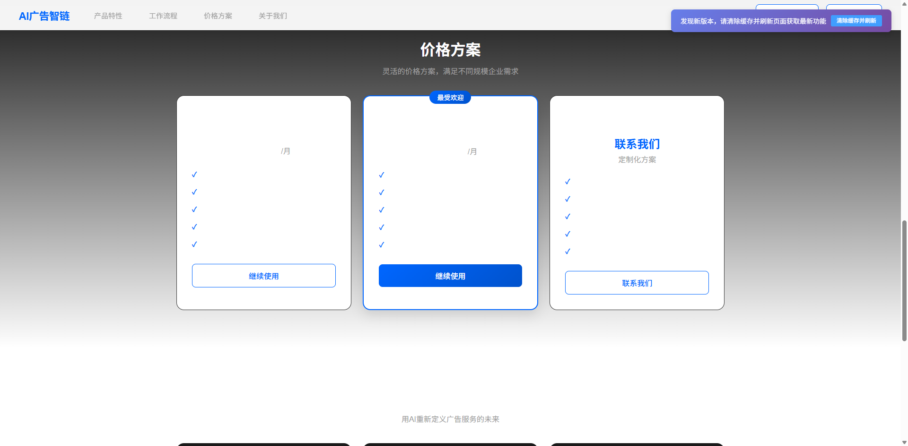

价格方案页面用于展示不同规模团队的服务套餐，也支持定制化方案沟通。

## 适用场景

- 品牌广告策略与传播方案生成
- 产品定位、用户洞察和卖点提炼
- 社媒文案、海报文案、短视频脚本和广告创意生成
- HTML 落地页、广告视觉和视频内容生产
- 团队 AI 使用数据统计与成本分析
- 广告公司、品牌市场部和内容团队的 AI 协作工作台

## 技术栈

- 前端：Vue 3、Vite 6、Pinia、Vue Router、Element Plus、ECharts、Quill、Axios
- 后端：Python、Flask、SQLAlchemy、Flask-JWT-Extended、Celery、Redis、Alembic
- 数据库：MySQL / PostgreSQL / SQLite，按环境配置
- 存储：华为云 OBS
- 部署：Docker、Docker Compose、Nginx、Gunicorn

## 项目结构

```text
.
├── backend/                  # Flask API、模型、服务、任务队列与迁移
│   ├── app/
│   │   ├── api/              # API 路由
│   │   ├── models/           # 数据模型
│   │   ├── services/         # Dify、MJ、短信、认证等服务
│   │   ├── tasks/            # Celery 异步任务
│   │   └── utils/            # 工具函数
│   ├── migrations/           # Alembic 数据库迁移
│   └── tests/                # 后端测试
├── frontend/                 # Vue 3 + Vite 前端应用
│   └── src/
├── specs/                    # 功能设计与接口调研文档
├── docker-compose.yml        # 生产/部署编排示例
├── docker-compose.dev.yml    # 开发环境编排示例
└── 环境变量与密钥配置说明.md      # 环境变量与密钥配置说明
```

## 快速开始

### 环境要求

- Node.js 18+
- Python 3.10+
- npm
- Redis
- MySQL / PostgreSQL / SQLite
- 可选：Docker 与 Docker Compose
- 你计划使用的 AI、短信、对象存储服务密钥

### 1. 克隆项目

```bash
git clone https://github.com/sorakiii/xinliu-ad-intelligence-chain.git
cd xinliu-ad-intelligence-chain
```

### 2. 配置后端环境变量

复制后端环境变量模板：

```bash
cp backend/app/.env.example backend/app/.env
```

然后按需填写数据库、Redis、JWT、Dify、DashScope、Midjourney、短信、OBS 等配置。完整说明见 `环境变量与密钥配置说明.md`。

不要把真实密钥提交到仓库。

### 3. 启动后端

```bash
cd backend
python3 -m venv .venv
source .venv/bin/activate
pip install -r app/requirements.txt
python run.py
```

后端默认服务端口以环境变量和 `backend/app/config.py` 为准，常用本地地址为 `http://localhost:5002`。

### 4. 启动前端

另开一个终端：

```bash
cd frontend
npm install
npm run dev
```

前端开发服务默认运行在 `http://localhost:3005`。

### 5. Docker Compose 启动

项目提供 `docker-compose.yml` 与 `docker-compose.dev.yml`。根据自己的数据库、Redis、域名、证书与环境变量配置后，可使用：

```bash
docker compose up -d --build
```

## 环境变量

完整变量列表以 `backend/app/.env.example`、`frontend/.env.example` 和 `环境变量与密钥配置说明.md` 为准。常见变量包括：

- `SQLALCHEMY_DATABASE_URI`
- `REDIS_URL`
- `JWT_SECRET_KEY`
- `DIFY_API_URL`
- `DIFY_API_KEY`
- `DIFY_API_KEY_HTML_ZIP`
- `DIFY_API_KEY_HTML_RAW`
- `DIFY_API_KEY_VIDEO_SCRIPT`
- `DIFY_API_KEY_MJ_PROMPT`
- `DASHSCOPE_API_KEY`
- `MJ_API_URL`
- `MJ_API_KEY`
- `MJ_APP_KEY`
- `SMS_ACCOUNT`
- `SMS_PASSWORD`
- `SMS_SIGN_NAME`
- `OBS_ACCESS_KEY`
- `OBS_SECRET_KEY`
- `OBS_ENDPOINT`
- `OBS_BUCKET`
- `VITE_API_URL`
- `VITE_EQMJ_HOME`

前端变量必须使用 `VITE_` 前缀，并且不得包含任何服务端密钥。

## API 与模块说明

后端主要模块：

- `backend/app/api/auth.py`：注册、登录、验证码、JWT
- `backend/app/api/chat.py`：多角色 AI 对话、文件上传、会话管理
- `backend/app/api/html.py`：HTML 生成与预览
- `backend/app/api/mj.py`：Midjourney 图像生成任务
- `backend/app/api/video.py`：视频生成任务
- `backend/app/api/analytics.py`：统计分析
- `backend/app/api/roles.py`：AI 角色管理

更详细的后端说明见 `backend/README.md`，前端说明见 `frontend/README.md`。

## 安全说明

- 不要提交 `.env`、`.env.*`、真实 API Key、短信账号、OBS AK/SK、数据库连接串或生产日志。
- `frontend/.env.development` 与 `frontend/.env.production` 默认被忽略；公开配置请放在 `frontend/.env.example`。
- `backend/logs/`、`__pycache__/`、构建产物与本地调试文件默认不进入仓库。
- 若项目曾在私有开发阶段使用真实密钥，公开部署或 fork 前建议先轮换密钥。
- `blackgroud/` 当前按实验目录处理，默认不发布。

## 项目状态

心流广告智链目前已完成登录体系、单角色服务、智能会话、会话历史、文件上传、产品展示页和数据分析等核心能力，并扩展了 HTML 生成、图像生成和视频生成等多模态创作方向，适合用于广告服务平台展示、产品演示和团队内部 AI 创作协作。

## English Overview

**Xinliu Advertising Intelligence Chain** is an AI-powered advertising creativity and content production platform by Xinliu Creation. It combines role-based AI collaboration, strategy insight, creative generation, conversation management, analytics, and multimodal content workflows.

The platform uses specialized AI roles as its core interaction model, allowing users to work with virtual experts for demand analysis, product positioning, user insight, communication strategy, copywriting, short-video planning, content optimization, and usage review.

### English Features

- Multi-role AI chat and session management
- Specialized role services for strategy insight, creative content, and open communication
- File upload and persistent conversation history
- HTML landing page generation and preview
- Midjourney / EQMJ image generation task management
- Text-to-video task management and status tracking
- Token ranking, role usage charts, module details, and date filtering
- Product introduction, feature, workflow, and pricing pages

### License

MIT License. See `LICENSE`.
