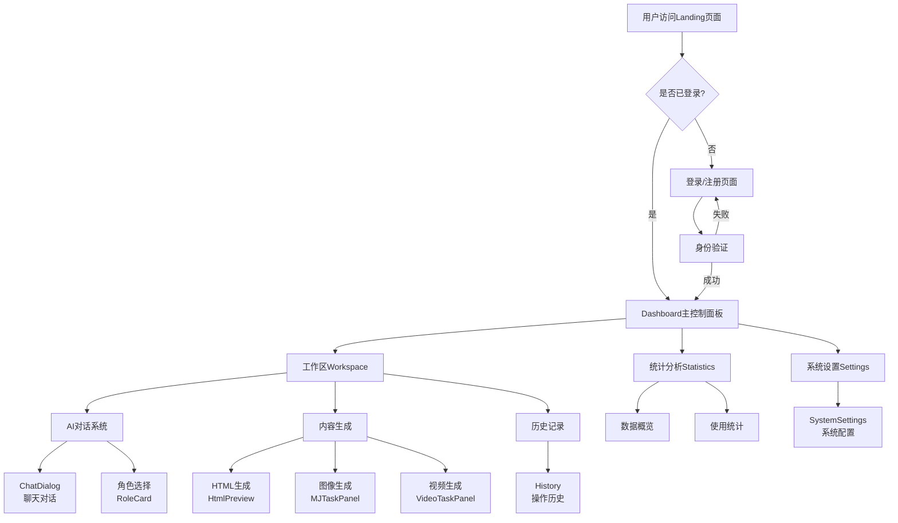
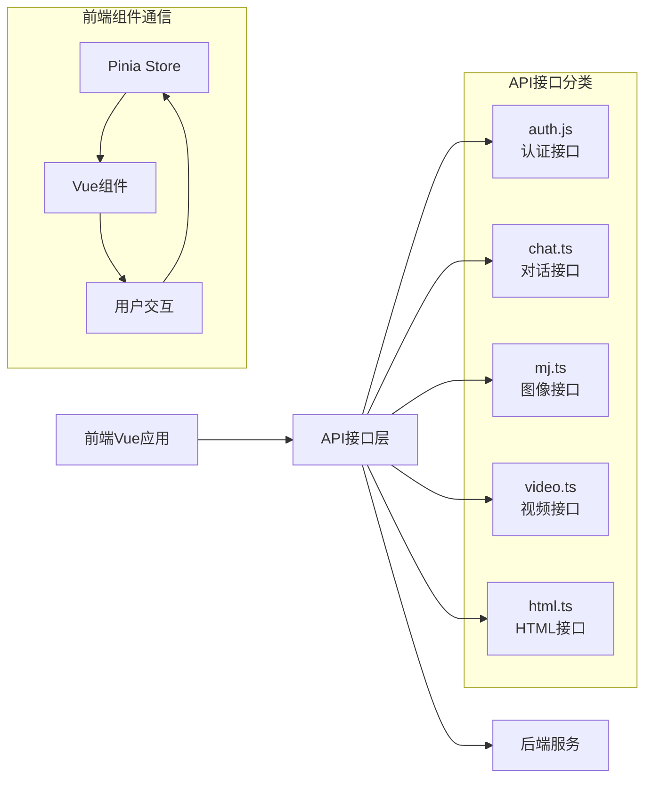
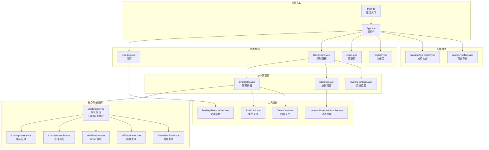

# 心流广告智链前端项目文档

## 项目概述
本项目是心流广告智链的前端系统，基于 Vue 3 + Vite 构建，提供 AI 角色协作、广告创意生产、会话管理和数据分析功能。

## 技术栈
- **核心框架**: Vue 3
- **构建工具**: Vite 6.x
- **状态管理**: Pinia
- **UI 框架**: Element Plus
- **路由管理**: Vue Router 4
- **图表库**: ECharts 5
- **富文本编辑**: Quill
- **HTTP 客户端**: Axios
- **其他工具**:
  - date-fns (日期处理)
  - marked (Markdown 渲染)
  - v-viewer (图片预览)
  - highlight.js (代码高亮)

## 项目结构
```
frontend/
├── src/                          # 源代码目录
│   ├── api/                     # API 接口定义
│   │   ├── auth.js             # 用户认证相关接口
│   │   ├── chat.ts             # 聊天对话相关接口
│   │   ├── html.ts             # HTML 生成相关接口
│   │   ├── mj.ts               # Midjourney 图像生成接口
│   │   ├── roles.ts            # 角色管理相关接口
│   │   └── video.ts            # 视频处理相关接口
│   ├── assets/                 # 静态资源文件
│   ├── components/             # 公共组件
│   │   ├── auth/              # 认证相关组件
│   │   ├── common/            # 通用组件
│   │   │   └── AnimatedNumber.vue # 动态数字展示组件
│   │   ├── landing/           # 首页相关组件
│   │   ├── statistics/        # 统计相关组件
│   │   ├── workspace/         # 工作区相关组件
│   │   │   ├── ChatDialog.vue           # 聊天对话主组件
│   │   │   ├── ChatInputArea.vue        # 聊天输入区域组件
│   │   │   ├── ChatSessionList.vue      # 聊天会话列表组件
│   │   │   ├── HtmlPreview.vue          # HTML 预览组件
│   │   │   ├── MJTaskPanel.vue          # Midjourney 任务面板
│   │   │   ├── PageHeader.vue           # 页面头部组件
│   │   │   ├── ProcessStep.vue          # 流程步骤组件
│   │   │   ├── ProductValidationForm.vue # 产品验证表单
│   │   │   ├── RoleCard.vue             # 角色卡片组件
│   │   │   ├── StrategyForm.vue         # 策略表单组件
│   │   │   ├── TeamCard.vue             # 团队卡片组件
│   │   │   └── VideoTaskPanel.vue       # 视频任务面板
│   ├── config/                # 全局配置文件
│   │   └── index.js          # 主配置文件
│   ├── layouts/              # 布局组件
│   ├── AppHeader.vue    # 应用头部组件
│   ├── TopNav.vue       # 顶部导航组件
│   ├── MainLayout.vue   # 主布局组件  
│   └── BlankLayout.vue  # 空白布局组件
├── router/               # 路由配置
│   │   └── index.js         # 路由主配置文件
│   ├── stores/               # Pinia 状态管理
│   │   └── user.js          # 用户状态管理
│   ├── styles/               # 全局样式文件
│   │   └── variables.css    # CSS 变量定义
│   ├── types/                # TypeScript 类型定义
│   ├── utils/                # 工具函数
│   │   ├── auth.js          # 认证相关工具函数
│   │   ├── clipboard.js     # 剪贴板操作工具
│   │   ├── message.js       # 消息处理工具
│   │   ├── request.js       # HTTP 请求封装
│   │   └── time.js          # 时间处理工具
│   ├── views/                # 页面视图组件
│   │   ├── auth/            # 认证相关页面
│   │   │   ├── Login.vue           # 登录页面
│   │   │   ├── Register.vue        # 注册页面
│   │   │   └── ResetPassword.vue   # 重置密码页面
│   │   ├── settings/        # 设置相关页面
│   │   │   └── SystemSettings.vue  # 系统设置页面
│   │   ├── workspace/       # 工作区相关页面
│   │   │   ├── history/            # 历史记录相关页面
│   │   │   ├── ChatDetail.vue      # 聊天详情页面
│   │   │   ├── History.vue         # 历史记录页面
│   │   │   ├── SingleRole.vue      # 单个角色页面
│   │   │   ├── Statistics.vue      # 统计数据页面
│   │   │   └── TargetedService.vue # 定向服务页面
│   │   ├── Dashboard.vue    # 主控制面板页面
│   │   └── Landing.vue      # 首页/着陆页
│   ├── App.vue              # 根组件
│   └── main.js              # 应用入口文件
├── public/                  # 静态资源目录
├── index.html               # HTML 模板
├── vite.config.js          # Vite 配置文件
├── package.json            # 项目依赖配置
├── nginx.conf              # Nginx 配置文件
├── Dockerfile              # 生产环境 Docker 配置
└── Dockerfile.dev          # 开发环境 Docker 配置
```

## 详细文件功能说明

### 📁 API 接口层 (`/src/api/`)
- **auth.js**: 处理用户登录、注册、退出等认证相关的API调用
- **chat.ts**: 管理AI聊天对话、消息发送接收、会话管理等接口
- **html.ts**: 处理HTML代码生成、预览、导出等功能的API
- **mj.ts**: 集成Midjourney图像生成服务的API接口
- **roles.ts**: 管理AI角色的创建、编辑、删除等操作接口
- **video.ts**: 处理视频生成、编辑、导出等视频相关功能

### 🎨 组件层 (`/src/components/`)

#### 通用组件 (`common/`)
- **AnimatedNumber.vue**: 动态数字展示组件，用于统计数据动画

#### 工作区组件 (`workspace/`)
- **ChatDialog.vue**: 核心聊天对话组件，处理AI对话交互（122KB，4786行 - 最复杂组件）
- **ChatInputArea.vue**: 聊天输入区域，包含文本输入、文件上传、快捷操作
- **ChatSessionList.vue**: 聊天会话列表，管理多个对话会话
- **HtmlPreview.vue**: HTML代码实时预览组件，支持代码高亮和预览
- **MJTaskPanel.vue**: Midjourney任务面板，管理图像生成任务
- **VideoTaskPanel.vue**: 视频任务面板，处理视频生成和编辑任务
- **ProductValidationForm.vue**: 产品验证表单，用于产品功能验证
- **StrategyForm.vue**: 策略配置表单，设置AI对话策略
- **RoleCard.vue**: AI角色卡片，展示和选择AI角色
- **TeamCard.vue**: 团队卡片，展示团队协作功能
- **PageHeader.vue**: 页面头部组件，显示页面标题和操作按钮
- **ProcessStep.vue**: 流程步骤组件，展示任务执行进度

### 🏗 布局层 (`/src/layouts/`)
- **MainLayout.vue**: 主布局组件，包含侧边栏、头部等完整布局结构
- **BlankLayout.vue**: 空白布局组件，用于登录页等简洁页面
- **AppHeader.vue**: 应用顶部头部，包含logo、用户信息、导航菜单
- **TopNav.vue**: 主导航栏，包含主要功能模块的导航链接

### 📄 页面视图层 (`/src/views/`)

#### 认证页面 (`auth/`)
- **Login.vue**: 用户登录页面，包含登录表单和第三方登录
- **Register.vue**: 用户注册页面，包含注册表单和验证逻辑
- **ResetPassword.vue**: 密码重置页面，处理忘记密码流程

#### 工作区页面 (`workspace/`)
- **ChatDetail.vue**: 聊天详情页面，展示完整的对话内容和历史
- **SingleRole.vue**: 单个AI角色详情页面，配置和管理特定角色
- **Statistics.vue**: 统计数据页面，展示使用统计和分析
- **TargetedService.vue**: 定向服务页面，提供专业服务功能
- **History.vue**: 通用历史记录页面

#### 其他页面
- **Dashboard.vue**: 主控制面板，展示概览信息和快捷操作
- **Landing.vue**: 首页/着陆页，产品介绍和功能展示（31KB，1317行）
- **SystemSettings.vue**: 系统设置页面，管理系统配置参数

### 🛠 工具函数层 (`/src/utils/`)
- **auth.js**: 认证相关工具函数，如token处理、权限验证
- **clipboard.js**: 剪贴板操作工具，支持复制粘贴功能
- **message.js**: 消息处理工具，统一消息提示和通知
- **request.js**: HTTP请求封装，包含拦截器和错误处理
- **time.js**: 时间处理工具，格式化和计算时间

### 🏪 状态管理层 (`/src/stores/`)
- **user.js**: 用户状态管理，包含用户信息、登录状态、权限等

### 🛣 路由配置 (`/src/router/`)
- **index.js**: 路由主配置文件，定义所有页面路由和导航守卫

### ⚙️ 配置文件 (`/src/config/`)
- **index.js**: 全局配置文件，包含API地址、系统参数等

## 主要功能模块

### 1. 用户认证与授权 🔐
- 用户登录/注册系统
- JWT token 管理
- 权限验证和路由守卫
- 密码重置功能

### 2. AI 对话系统 🤖
- 多角色AI对话
- 实时聊天交互
- 会话历史管理
- 角色策略配置

### 3. 内容生成 🎨
- HTML代码生成和预览
- Midjourney图像生成
- 视频内容创作
- 产品验证和优化

### 4. 数据统计 📊
- 使用统计分析
- 效果数据展示
- 历史记录管理
- 团队协作统计

### 5. 系统管理 ⚙️
- 系统参数配置
- 用户权限管理
- 服务状态监控

## 开发流程

### 本地开发
```bash
# 安装依赖
npm install

# 启动开发服务器
npm run dev
```

### 生产构建
```bash
# 构建生产版本
npm run build

# 预览生产构建
npm run preview
```

## 系统架构流程图



## 数据流向图



## 组件关系图



## 技术架构说明

### 前端技术选型说明
1. **Vue 3 + Composition API**: 提供更好的类型推导和逻辑复用
2. **Vite**: 快速的开发构建工具，支持热更新
3. **Pinia**: Vue 3 推荐的状态管理工具，替代Vuex
4. **Element Plus**: 成熟的Vue 3 UI组件库，提供丰富的组件
5. **ECharts**: 强大的数据可视化图表库
6. **TypeScript**: 部分文件使用TS，提供更好的类型安全

### 项目特点
- **大型单页应用**: Landing.vue(31KB)和ChatDialog.vue(122KB)为超大组件
- **AI驱动**: 核心功能围绕AI对话、内容生成展开
- **多媒体支持**: 支持HTML、图像、视频等多种内容生成
- **实时交互**: 支持实时聊天和内容预览
- **模块化设计**: 组件职责明确，便于维护和扩展

## 开发规范

### 1. 代码规范
- 使用 ESLint 进行代码检查
- 遵循 Vue 3 组合式 API 的最佳实践
- 组件命名采用 PascalCase
- 文件命名采用 kebab-case

### 2. 提交规范
- feat: 新功能
- fix: 修复问题
- docs: 文档修改
- style: 代码格式修改
- refactor: 代码重构
- test: 测试用例修改
- chore: 其他修改

### 3. 组件开发规范
- 单一职责原则
- 组件通信规范
- Props 和事件命名规范
- 状态管理使用规范

## 部署说明
项目使用 Docker 进行容器化部署，包含开发环境（Dockerfile.dev）和生产环境（Dockerfile）两个配置文件。

### Docker 部署步骤
1. 构建镜像
2. 配置环境变量
3. 运行容器
4. Nginx 反向代理配置

## 关键文件说明

### 📋 配置文件详解

#### `package.json` - 项目配置
```json
{
  "name": "xinliu-ad-intelligence-chain",
  "scripts": {
    "dev": "vite --port 3005",    // 开发服务器端口3005
    "build": "vite build",        // 生产构建
    "preview": "vite preview --port 3005"
  }
}
```

#### `main.js` - 应用入口
```javascript
// 核心配置：Vue 3 + Pinia + Element Plus + 中文本地化
import { createApp } from "vue";
import { createPinia } from "pinia";
import ElementPlus from "element-plus";
import zhCn from "element-plus/dist/locale/zh-cn.mjs";
```

### 📊 复杂度统计
| 文件 | 大小 | 行数 | 复杂度 | 主要功能 |
|------|------|------|--------|----------|
| ChatDialog.vue | 122KB | 4786行 | ⭐⭐⭐⭐⭐ | 核心聊天对话组件 |
| ChatInputArea.vue | 35KB | 1341行 | ⭐⭐⭐⭐ | 聊天输入区域 |
| HtmlPreview.vue | 34KB | 1359行 | ⭐⭐⭐⭐ | HTML预览组件 |
| Landing.vue | 31KB | 1317行 | ⭐⭐⭐⭐ | 首页展示组件 |
| MJTaskPanel.vue | 28KB | 965行 | ⭐⭐⭐ | 图像生成面板 |
| MainLayout.vue | 21KB | 941行 | ⭐⭐⭐ | 主布局组件 |

### 🔧 开发建议

#### 性能优化要点
1. **大组件拆分**: ChatDialog.vue过大，建议拆分为多个子组件
2. **懒加载**: 对大体积组件使用路由懒加载
3. **图片优化**: 使用v-viewer进行图片预览优化
4. **代码分割**: 利用Vite的代码分割功能

#### 维护要点
1. **组件复用**: 提取公共逻辑到composables
2. **类型安全**: 逐步迁移到TypeScript
3. **测试覆盖**: 为核心组件添加单元测试
4. **文档完善**: 为复杂组件添加详细注释

## 部署说明
项目支持Docker容器化部署：
- **开发环境**: `Dockerfile.dev` - 用于开发调试
- **生产环境**: `Dockerfile` + `nginx.conf` - 生产部署配置
- **端口配置**: 默认使用3005端口
- **反向代理**: 通过Nginx处理静态资源和API代理

## 注意事项
1. **Node.js版本**: 确保使用Node.js 16+版本
2. **内存要求**: 由于包含大型组件，建议开发环境至少8GB内存
3. **性能监控**: 定期检查ChatDialog等大组件的性能表现
4. **依赖更新**: 定期更新Vue、Element Plus等核心依赖
5. **安全考虑**: API接口需要适当的权限验证和数据校验

## 项目维护联系方式
- 项目类型：AI内容生成平台前端
- 技术栈：Vue 3 + TypeScript + Element Plus
- 开发端口：3005
- 主要特性：AI对话、内容生成、多媒体支持
